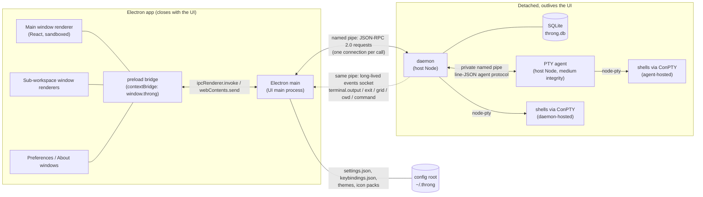
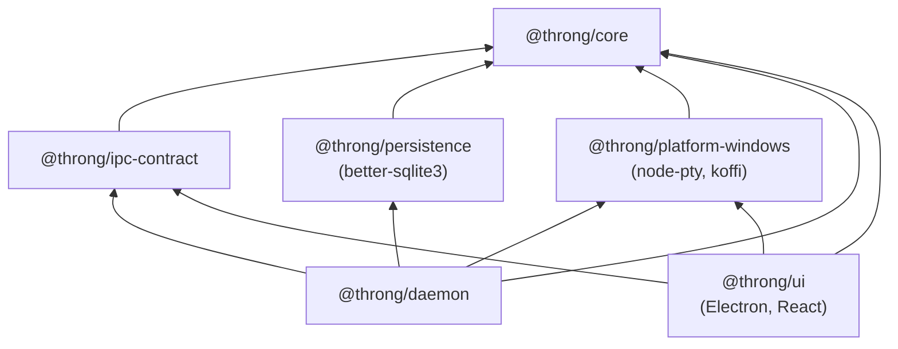
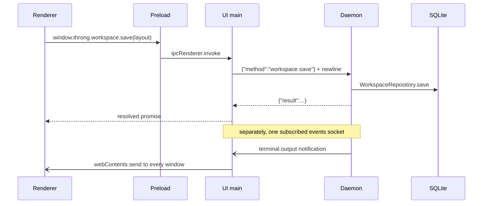
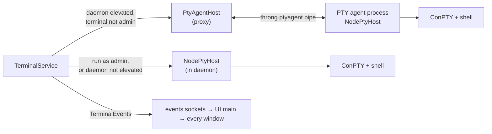
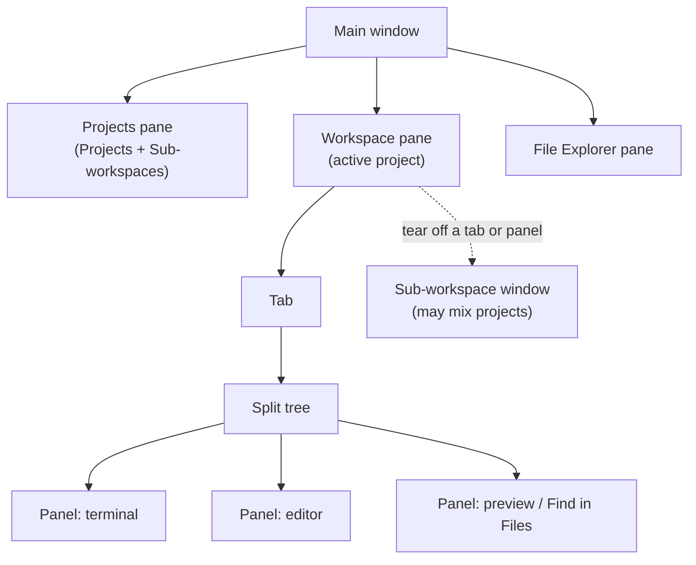
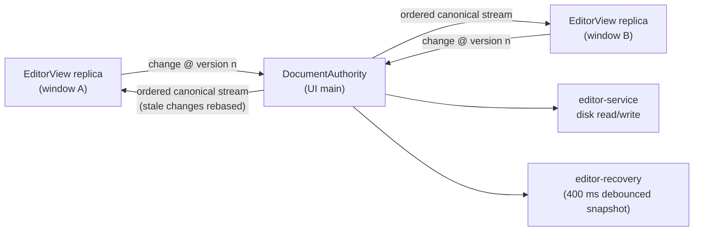
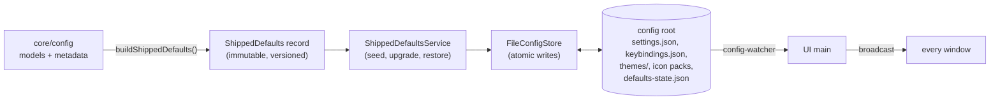

[throng](../README.md) › [Docs](README.md) › Architecture

# Architecture

How throng is put together: which processes run, what each package owns, and how the parts talk to
each other. Each section below covers one domain: what it is for, where its code lives, its key
abstractions, how it reaches the other domains, and the
[constitution](../.specify/memory/constitution.md) principles that bind it. The principles are
linked, not restated. The constitution is the authority, and this page describes the code that
follows it.

## Contents

- [Process topology](#process-topology)
- [Package graph](#package-graph)
- [Core domain and dependency injection](#core-domain-and-dependency-injection)
- [Daemon, RPC and persistence](#daemon-rpc-and-persistence)
- [Terminals and the PTY agent](#terminals-and-the-pty-agent)
- [Renderer, workspace and focus](#renderer-workspace-and-focus)
- [Editor and documents](#editor-and-documents)
- [Explorer and file operations](#explorer-and-file-operations)
- [Search, Quick Open and links](#search-quick-open-and-links)
- [Preview](#preview)
- [Configuration and shipped defaults](#configuration-and-shipped-defaults)
- [Failure notices and diagnostics](#failure-notices-and-diagnostics)
- [Build and packaging](#build-and-packaging)

## Process topology

throng runs as several cooperating OS processes. The Electron app, meaning the main process and its
renderer windows, is the part the user sees and closes. The **daemon** is a separate, detached
host-Node process that owns every terminal and the database, so closing the app never ends a shell
([III. Detached, Tagged & Persistent Terminals](../.specify/memory/constitution.md#iii-detached-tagged--persistent-terminals)).

| Process | Runs | Owns |
|---|---|---|
| **Electron main** (`packages/ui/src/main`) | Electron | Windows and their placement, the app menu, the preload IPC surface, the config store and its hot-reload, the editor document authority, file operations and watching, Quick Open's index, Find in Files, previews, clipboard, diagnostics, and the daemon's lifecycle. |
| **Renderers** (`packages/ui/src/renderer`) | Electron renderer, sandboxed | The React UI: one main window, any number of sub-workspace windows, the preferences and About windows. No filesystem, no SQLite, no OS calls: everything privileged goes through the preload bridge. |
| **Preload** (`packages/ui/src/preload/preload.cts`) | Isolated world of each renderer | The only bridge, exposed as `window.throng`. It also applies the saved theme before first paint. |
| **Daemon** (`packages/daemon`) | Bundled host `node.exe`, detached | Every terminal PTY, the SQLite store (the only writer), per-project layouts, sub-workspaces, per-document state, the file-operation undo stack and panel names. |
| **PTY agent** (`packages/daemon/src/pty-agent-entry.ts`) | Host Node, medium integrity | Terminals that must run at the user's own integrity when the daemon itself is elevated. |
| **Shells** | PowerShell, Git Bash, CMD, custom flavours | The user's processes, each on its own ConPTY. |
| **Drag ghost** (`ghost-window.ts`) | A frameless, click-through `BrowserWindow` | The cursor-following ghost of a dragged tab or panel, which must paint outside the app's own window. |

**The request path.** A renderer never touches SQLite or the OS. It calls `window.throng.*`, the
preload forwards it over Electron IPC to main, and main either answers it itself or makes a JSON-RPC
call to the daemon through `DaemonClient`. Terminal output travels the other way: the daemon writes
notifications to every subscribed events socket, main's `DaemonEvents` holds one such socket and
broadcasts each notification to **every** window, and each window filters by panel id. That
broadcast is what lets one terminal session be mirrored in several panels and windows.

**Startup.** Main's `ensureDaemon` (`daemon-lifecycle.ts`) pings the pipe with `health.ping`. If a
daemon answers and is current, main adopts it and its terminals reattach. Otherwise main spawns the
daemon detached and unref'd, under host Node (never Electron, whose Node ABI does not match the
daemon's native modules), and waits for it to answer. The pipe itself is the single-instance lock:
if two UIs spawn at once, only one daemon binds it, and both connect to that one.

**Retiring a daemon.** The daemon build is stamped with a content hash (`dist/BUILD_ID`, see
[Build and packaging](#build-and-packaging)). A running daemon is **retired and respawned**, which
ends its terminals, when:

- its build id differs from the one on disk, or it reports none;
- the app is elevated and the daemon is not (integrity cannot be raised in place); or
- its own entry file no longer exists on disk (a portable build whose temp folder has gone).

A daemon whose entry path is not this app's own is **foreign**, and is never retired: main carries on
without a daemon rather than end another instance's terminals. Instance separation is the first line
of defence. A dev run (`npm start`) and the portable build each take their own pipe, config root and
data folder, so a rebuild never retires the installed app's daemon (`instance-paths.ts`). The
locations and their overrides are listed in [environment.md](environment.md).

**Losing the daemon.** `DaemonSupervisor` watches the events socket. A close enters `reconnecting`
and only becomes `stopped` when a grace period expires, so an ordinary rebuild-and-retire raises no
false alarm. The transition rules are pure (`core/src/failure/daemon-state.ts`), and a stopped
daemon is reported once, as described in [Failure notices and diagnostics](#failure-notices-and-diagnostics).

## Package graph

An npm-workspaces monorepo. The packages map to the constitution's boundaries, and the arrows only
point one way.

| Package | Role |
|---|---|
| `@throng/core` | Platform- and process-agnostic core: the OS-abstraction interfaces, the storage ports, the typed configuration models, and the pure domain logic and state machines. It imports no Electron, no Node built-in and no native module. Its only runtime dependencies are pure libraries (`@codemirror/state`, `@codemirror/search`, `picomatch`). |
| `@throng/ipc-contract` | The JSON-RPC 2.0 message shapes shared by the daemon and UI main: method names, params, results, notifications and error codes. |
| `@throng/persistence` | The embedded SQLite store: connection, `user_version` migration runner, schema-drift guard, and the repositories that implement core's ports. `better-sqlite3` lives here and nowhere else. |
| `@throng/platform-windows` | The Windows implementations of core's abstractions. `node-pty`, `koffi` and every Win32 call live here and nowhere else. |
| `@throng/daemon` | The detached background process: IPC server, RPC router, per-domain RPC services, terminal service and the PTY agent. |
| `@throng/ui` | The Electron client: main process, preload and the React renderer. |

A dependency the other way, such as `core` importing `electron`, `node:*`, `better-sqlite3`,
`node-pty` or `koffi`, is a defect. `packages/core/tests/unit/no-os-imports.test.ts` fails the build
on one.

## Core domain and dependency injection

`@throng/core` holds the rules. Other packages supply the answers only an OS or a process can give,
and each process wires the two together in one place.

**Folders.**

- `abstractions/`: the OS seams, including `pty-host`, `shell-detection`, `elevation`,
  `de-elevator`, `file-system`, `file-watcher`, `clipboard`, `display-info`, `font-enumeration`,
  `platform-info`, `process-cwd`, `directory-lock`, `shell-integration`, `user-context`,
  `config-store`, `foreground-handoff`, `path-forms`, `executable-extensions` and
  `refused-uri-schemes`.
- `ports/`: the storage contracts `project-store`, `workspace-store` and `subworkspace-store`,
  implemented by `@throng/persistence`.
- Domain: `projects/`, `workspace/`, `panel-type/`, `terminal/`, `editor/`, `explorer/`, `fs/`,
  `fileop-undo/`, `preview/`, `find-in-files/`, `search/`, `links/`, `navigation/`, `picker/`,
  `text/`, `display/`, `failure/`, `notice/` and `diagnostics/`.
- `config/`: the settings, key bindings, themes and icon packs, with their editor-metadata
  registries. See [Configuration and shipped defaults](#configuration-and-shipped-defaults).
- `testing/`: one **contract suite** per abstraction (`*-contract.ts`), exported as
  `@throng/core/testing`.

**Composition roots.** Each process has exactly one:

| Process | Composition root | Tokens |
|---|---|---|
| Daemon | `packages/daemon/src/composition-root.ts` (`createDaemonContainer`) | `packages/daemon/src/tokens.ts` (`DAEMON_TYPES`) |
| Electron main | `packages/ui/src/main/composition-root.ts` (`createUiContainer`) | `packages/ui/src/main/tokens.ts` (`UI_TYPES`) |
| Renderer | `packages/ui/src/renderer/composition-root.tsx` | React context (`ServicesProvider` / `useServices`) |

The daemon and main use InversifyJS 8 containers with legacy decorators. `reflect-metadata` is
imported first at each entry point. The renderer runs in a separate realm that cannot share main's
container, so it constructs its clients once (bridge, projects, workspace, sub-workspaces,
documents, file-operation undo, panel names) and hands them down through context. Tests replace
them through the same provider. Environment variables are read in the composition roots and nowhere
else, and are passed in as typed settings objects.

**Adding an OS-dependent capability.** Each step builds on the one before:

1. An interface in `core/src/abstractions/`, written in domain terms.
2. A DI token in each process that needs it.
3. A Windows implementation in `platform-windows/src`.
4. A binding in each of those processes' composition roots.
5. A contract suite in `core/src/testing`.
6. A contract test that runs the suite against the real implementation
   (`packages/platform-windows/tests/contract/`, or `packages/ui/tests/contract/` for an Electron
   seam).

Binds: [II. Platform-Abstracted Core](../.specify/memory/constitution.md#ii-platform-abstracted-core-os-agnostic),
[VIII. SOLID, DRY & YAGNI](../.specify/memory/constitution.md#viii-solid-dry--yagni-engineering-discipline),
[IX. Dependency Injection & Composition Root](../.specify/memory/constitution.md#ix-dependency-injection--composition-root),
[X. Externalised Configuration](../.specify/memory/constitution.md#x-externalised-configuration).

### Adding a platform port

`packages/core` states the rules, a `packages/platform-*` package answers the OS questions, and a
**contract suite** in `packages/core/src/testing/` decides whether an implementation counts as one.
Clickable file links use two ports, and they are the current worked example. A new platform gets
links working by implementing these two and nothing else.

- **`IPathForms`** (`packages/core/src/abstractions/path-forms.ts`) covers the four path
  *spellings* only an OS can map: `homeDirectory()`, `fromDriveForm()` (`/d/x` and `/mnt/d/x`),
  `fromFileUrl()` (a `file:` URI, percent-decoded, host to UNC) and `fromHomeForm()` (`~`). Every
  method is **total**. It returns `null` rather than throwing when the input is not its form.
- **`IExecutableExtensions`** (`packages/core/src/abstractions/executable-extensions.ts`) answers
  whether the OS would *run* a file, judged from its extension alone. The feature calls
  `isExecutable(path)`. `executableExtensions()` reports the whole set, which lets the test assert
  that **none** of them runs on a click, without a hand-copied list that would go stale.

The Windows implementations are `packages/platform-windows/src/windows-path-forms.ts` and
`windows-executable-extensions.ts`. Both are bound in the UI composition root, under
`UI_TYPES.PathForms` and `UI_TYPES.ExecutableExtensions`.

The contract suites are `runPathFormsContract(makeSubject)` and
`runExecutableExtensionsContract(makeSubject)`. They use the repo's **pure-throw** style: the file
imports nothing, not even a test runner, and reports a failure by throwing
`IPathForms contract violation: …`. That keeps `@throng/core` free of a test dependency and lets any
layer run the suite. A platform package calls it from one `it(...)`
(`packages/platform-windows/tests/contract/windows-path-forms.contract.test.ts`).

The suites check two rules:

- **Assert shape and relationship, never a literal path.** The suite says that
  `fromDriveForm('/d/git/x')` names drive `d` and ends in `git` + separator + `x`. It does not say
  `D:\git\x`. A macOS or Linux implementation therefore passes without the suite being rewritten.
- **Totality.** No method throws for any string: an empty one, one containing a NUL, a very long
  one, one with mixed separators. Anything the port does not recognise returns `null` or `false`.

Nothing under `packages/core/src/links/` may name an operating system, an extension or a drive
mapping. `packages/core/tests/unit/links-no-os-names.test.ts` fails the build on one, alongside
`no-os-imports.test.ts`.

## Daemon, RPC and persistence

The daemon is the long-lived half of throng. It is the single SQLite writer, the owner of every
terminal, and the component that can see every panel in every project.

**Code.**

- `packages/daemon/src/main.ts`: the entry point. It composes the container, reaps orphaned helper
  processes left by a previous daemon, opens and migrates the store, and starts the IPC server. On
  SIGINT or SIGTERM it ends every terminal first, then releases the pipe and closes the database.
- `ipc-server.ts` handles the transport only. `rpc-router.ts` is the method registry and maps domain
  errors to JSON-RPC codes.
- The per-domain RPC services each register their own methods: `health-service`,
  `project-service`, `workspace-service`, `subworkspace-service`, `document-service`,
  `fileop-undo-service`, `panel-name-service` and `terminal-service`.
- `packages/ipc-contract/src` holds one module per namespace: `health.*`, `projects.*` (including
  `projects.categories.*`), `workspace.*`, `subworkspace.*`, `terminal.*`, `document.*`,
  `fileopUndo.*` and `panelName.*`.
- `packages/persistence/src` holds `database.ts`, `migration-runner.ts`, `schema-guard.ts` and one
  repository per store (projects, project categories, workspace layouts, sub-workspaces, document
  state, file-operation undo), with migrations in `migrations/v2…v10`.
- UI main's side of the wire is `daemon-client.ts` (requests), `daemon-events.ts` (the events
  socket), `daemon-lifecycle.ts` (spawn, adopt, retire) and `daemon-supervisor.ts` (reachability).

**The wire.** A Windows named pipe carrying newline-delimited JSON-RPC 2.0. The default pipe name is
per user, derived from the user token (`core/src/config/pipe-endpoint.ts`), so two accounts on one
machine never collide. `DaemonClient` opens one connection per request. A connection whose first
request is `terminal.subscribe` becomes a long-lived **events socket**, and the daemon pushes
`terminal.output`, `terminal.exit`, `terminal.grid`, `terminal.cwd` and `terminal.command`
notifications down it. A failure can carry a structured `error.data` payload, so the cause of a
failure crosses the wire as data rather than as a message string that has to be parsed
([Failure notices and diagnostics](#failure-notices-and-diagnostics)). Changing a method means
changing `ipc-contract`, both ends and the contract tests together. The shared package is what stops
a daemon build and a UI build drifting apart silently.

**Persistence.** The store is `throng.db` under the instance's data folder (see
[environment.md](environment.md) for overrides). The migration runner applies every migration above
SQLite's `user_version`. Every migration is idempotent. Every additive column is also registered in
`schema-guard.ts`, which repairs a database left half-migrated by an intermediate build, so a store
never reports "up to date" and then fails every write with `no such column`. The daemon logs any
repair it makes.

**Layout persistence.** The renderer's `workspace-store.tsx` writes the window and panel layout back
through `workspace.save` as the user works, on a **400 ms debounce**. It flushes the pending write on
every ordinary exit: closing a window, quitting, signing out or restarting. **This is a known and
accepted limit:** a termination the application cannot intercept (`SIGKILL`, *End task* in Task
Manager, a power loss) can lose **up to the last 400 ms** of layout changes. That is a deliberate
trade, not a defect. Dragging a panel emits a continuous stream of layout changes, and writing each
one straight through would turn a single drag into hundreds of disk writes. The debounce coalesces
them. Removing it to close a 400 ms window that only an uncatchable kill can open would cost every
user constant write churn for as long as they arrange panels, so the debounce must not be lowered or
removed. Every exit path the OS lets the app observe already drains the pending write before the
process goes.

Binds: [III. Detached, Tagged & Persistent Terminals](../.specify/memory/constitution.md#iii-detached-tagged--persistent-terminals),
[I. Project-First Context Isolation](../.specify/memory/constitution.md#i-project-first-context-isolation),
[IX. Dependency Injection & Composition Root](../.specify/memory/constitution.md#ix-dependency-injection--composition-root),
and the migration rules in
[Technology & Architecture Constraints](../.specify/memory/constitution.md#technology--architecture-constraints).

## Terminals and the PTY agent

Real installed shells, running inline as Terminal panels on PTYs owned by the daemon, so they
survive a UI restart and reattach with their scrollback.

**Code.**

- Daemon: `terminal-service.ts` (lifecycle, attach and detach, write, resize, kill, cwd and command
  observation), `terminal-events.ts` (the notification fan-out), `terminal-lock-manager.ts` (a
  reference-counted lock on the project root while a terminal runs in it), `reap-orphans.ts`, and
  the agent: `pty-agent-host.ts`, `pty-agent-entry.ts`, `pty-agent-protocol.ts`,
  `pty-agent-liveness.ts`, `pty-agent-childpids.ts` and `pty-agent-log.ts`.
- Platform: `platform-windows/src/node-pty-host.ts` (node-pty over ConPTY),
  `windows-shell-detection.ts`, `windows-elevation.ts`, `windows-de-elevated-launcher.ts`,
  `windows-process-cwd.ts`, `windows-directory-lock.ts`, `process-tree.ts` and
  `spawn-env-windows.ts`.
- Main: `terminal-ipc.ts`, `terminal-reconnect.ts`, `attach-serializer.ts`,
  `shell-detection-service.ts`.
- Renderer: `renderer/terminal/`, xterm.js 6 with the fit and search add-ons.
- Core: `core/src/terminal/`, the flavour-agnostic terminal state and the terminal panel type.

**Two PTY hosts.** node-pty loads in the daemon (and the agent), never in Electron. The daemon holds
two `IPtyHost`s and chooses one per terminal:

- the **local host**, a `NodePtyHost` at the daemon's own integrity (elevated when the app was
  launched elevated), used for run-as-administrator terminals; and
- the **agent host**, a `PtyAgentHost` proxy for terminals that must run at the user's own, medium,
  integrity while the daemon is elevated. A medium-integrity child cannot attach to a ConPTY the
  elevated daemon owns, so those terminals are hosted by a separate agent process that creates its
  own ConPTY.

The daemon launches the agent at startup, de-elevated through `WindowsDeElevatedLauncher` when the
daemon is elevated and as a plain child otherwise. The agent owns a private named pipe
(`throng.ptyagent.<pid>.<id>`), and the daemon connects down to it. They speak a line-JSON protocol
(`start`, `write`, `resize`, `kill`, `childpids`, `childprocs` one way; `ready`, `started`, `data`,
`exit`, `error` the other), and each terminal is keyed by an integer the daemon assigns. The agent's
first frame names the daemon's pid, so the agent can end its terminals and exit if the daemon dies
without closing the pipe.

**Process hygiene.** Every way a terminal can end must release everything it created, including the
per-terminal `conhost.exe`: the user closes it, it is killed, its panel is destroyed, its project is
deleted, the app closes with "end all", the shell exits by itself, or the daemon shuts down. Ending a
terminal deliberately leaves its panel in place, empty and ready to reuse. An unexpected exit shows
the shell's output and exit code. A new daemon reaps de-elevation agents, headless conhosts and
directory-lock holders whose parent has already died.

**The keyboard belongs to the terminal.** A chord throng consumes never reaches the shell, so which
keys may be bound in a terminal scope is decided by the constitution's reserved and shadowable tiers.
[key-bindings.md](key-bindings.md) documents them from the user's side.

Binds: [III. Detached, Tagged & Persistent Terminals](../.specify/memory/constitution.md#iii-detached-tagged--persistent-terminals),
[IV. Native Terminal Support & Auto-Detection](../.specify/memory/constitution.md#iv-native-terminal-support--auto-detection),
[II. Platform-Abstracted Core](../.specify/memory/constitution.md#ii-platform-abstracted-core-os-agnostic).

## Renderer, workspace and focus

The React 19 renderer, built by Vite with no CSS framework, draws the docking workspace. It holds
no privileged capability of its own.

**Code.** `packages/ui/src/renderer/`: `app.tsx` and `subworkspace-app.tsx` (the main and
sub-workspace window roots), `workspace/` (tab groups, the split tree, panel bodies, drag, menus,
focus), `panes/` (the side panes and their collapse rails), `sidebar/`, `title-bar/`, `statusbar/`,
`panel-type/`, `keybindings/scope.ts`, `theme/`, `common/` (icons, notifications, focus trap,
viewport clamping) and `state/` (the stores and the `*-client.ts` wrappers over the bridge). The
layout model and its operations are pure, in `core/src/workspace/` (`model.ts`, `operations.ts`,
`invariants.ts`, `focus-move.ts`, `unload.ts`, `sub-workspace.ts`) and `core/src/panel-type/`.

**The docking model.**

- **Panes** sit at the top level: the Projects pane, the Workspace pane and the File Explorer pane.
  The two side panes collapse and expand.
- **Tabs** live only in the Workspace pane. Each tab is a split tree of panels.
- **Panels** are typed through the panel-type registry (`core/src/panel-type/default-registry.ts`):
  terminal, editor, Find in Files and preview. The last two are created only by their own commands
  and never appear in the type picker. A panel reattaches only to its original project.
- **Sub-workspaces** are torn-off tabs or panels in their own OS windows. They form one focus and
  raise group with the main window, and closing the main window closes them all. Their contents and
  bounds persist through the daemon (`subworkspace.*`, `workspace.persistSubWorkspaces`).

**State.** Each window's stores (`workspace-store.tsx`, `projects-store.tsx`,
`subworkspaces-store.tsx`) talk to the daemon through the bridge, and the daemon is the source of
truth for layouts and projects. **Unload** closes a project's tabs and panels but keeps its saved
layout, either keeping its terminals to reattach later or ending them (`core/src/workspace/unload.ts`).

**Focus.** The active panel is a model value, and DOM focus follows it. Every panel type registers a
focus callback in `workspace/panel-focus.ts`. A focus requested before the panel has mounted is
parked and honoured when it registers, so switching project lands the caret in the right panel.
Moving focus between panels, side panes and notices is a command, not a click
([key-bindings.md](key-bindings.md)). throng closes menus on blur, so anything that steals window
focus affects every other surface.

Binds: [XI. Dockable Workspace: Panes, Tabs & Panels](../.specify/memory/constitution.md#xi-dockable-workspace-panes-tabs--panels),
[VI. Simple, Modern, Discoverable UX](../.specify/memory/constitution.md#vi-simple-modern-discoverable-ux)
(themeable icon controls, a menu item for every panel action),
[I. Project-First Context Isolation](../.specify/memory/constitution.md#i-project-first-context-isolation).

## Editor and documents

CodeMirror 6 editor panels over a document model with a single authority. One file open in several
panels, in any number of windows, is one document.

**Code.**

- Renderer: `renderer/editor/`, including `document-replica.ts`, `editor-views.ts`,
  `editor-state.ts`, the language loaders and picker, save and dirty-close handling, and the
  external-change notices.
- Main: `document-authority.ts`, `editor-coordinator.ts`, `editor-service.ts` (disk reads and
  writes, encoding and line endings), `editor-recovery.ts` and `editor-ipc.ts`.
- Core: `core/src/editor/` (`document.ts`, `document-sync.ts`, `effective-indent.ts`,
  `language-detect.ts`, `languages.ts`, `undo-persistence.ts`).
- Daemon: `document-service.ts` stores per-document state, such as a manual language override,
  keyed by file, through `DocumentStateRepository`.

**One authority.** UI main owns each open document's text, version and undo history in a
`DocumentAuthority`. Every `EditorView` in every window is a derived replica. A replica shows the
user's keystroke at once and sends the change to main. Main orders every change and **rebases** one
made against a superseded version rather than rejecting it, then broadcasts the canonical stream,
which every replica applies. The content, dirty state, undo and redo history, effective language and
effective indentation are shared. Only the cursor, selection, scroll and per-panel zoom differ
between views. Save All, crash recovery and the cross-window mirror all read from the authority, with
no round trip to a renderer.

**Recovery.** In-progress edits and their undo history are snapshotted on a 400 ms debounce and
restored after an abnormal exit. A file that moves, is deleted or changes on disk under an open
editor raises a notice rather than silently diverging.

Binds: [XI. Dockable Workspace: Panes, Tabs & Panels](../.specify/memory/constitution.md#xi-dockable-workspace-panes-tabs--panels)
(one document, one state),
[V. Test-First Quality Discipline](../.specify/memory/constitution.md#v-test-first-quality-discipline-non-negotiable).

## Explorer and file operations

The live, project-scoped file tree, and every filesystem operation the app performs: rename, move,
copy, delete to the Recycle Bin, and undo.

**Code.**

- Core: `core/src/explorer/` (tree nodes, expansion, drag payloads, naming, exclusion, path rules),
  `core/src/fs/path-id.ts` and `core/src/fileop-undo/undo-stack.ts`.
- Main: `files-service.ts`, `files-ipc.ts`, `node-file-system.ts` (the `IFileSystem` binding,
  with the Recycle Bin), `node-file-watcher.ts`, `explorer-watcher.ts`, `recycle-bin-restore.ts`,
  `undo-service.ts` and `in-app-moves.ts`; `file-clipboard.ts`, `transfer-service.ts` and
  `transfer-ipc.ts` for the clipboard and pastes.
- Renderer: `renderer/explorer/`, with the tree on react-arborist and drag and drop on `@dnd-kit`.
- Daemon and persistence: the per-project undo and redo stack is stored through `fileopUndo.*` and
  `FileOpUndoRepository`, so an undo survives a restart.

All filesystem work happens in UI main, not in the renderer (sandboxed) and not in the daemon
(which walks no files). A project's root is **exclusive**: no two projects share a root or nest
inside each other, so every file belongs to exactly one project. Paths arrive with mixed separators
and are normalised before any comparison or map key (`path-id.ts`).

The File Explorer clipboard is the application's, not a tree's: main holds one, by absolute path,
pushes it to every window, and follows in-app moves and deletes. Every paste and drag runs as a job
in main's transfer engine, one at a time inside the same queue and move bracket as every other file
operation: sources may come from any project's root, the target is always inside the active one, a
name clash is a question to the window that started the job, and the job's journal is what Cancel
rolls back and what the undo entry is built from. A move between projects is one undo entry held in
both projects' stacks.

Binds: [I. Project-First Context Isolation](../.specify/memory/constitution.md#i-project-first-context-isolation),
[II. Platform-Abstracted Core](../.specify/memory/constitution.md#ii-platform-abstracted-core-os-agnostic).

## Search, Quick Open and links

The features that find and follow things across a project.

- **Quick Open** is seeded from a per-project file index owned by UI main
  (`project-file-index.ts`, `file-index-ipc.ts`). The walk, the diff and the exclusion matcher are
  pure, in core. Main keeps the index current in two ways: a targeted rescan of the directory a
  watch signal names, and a trailing full reconcile that is forced after a maximum wait so sustained
  churn cannot starve it.
- **Find in Files** is a panel type whose scan runs in UI main (`file-search-service.ts`,
  `file-search-ipc.ts`, `replace-commit-service.ts`). It reuses the index's walk and exclusions,
  the editor's binary detection and size limit, and the find bar's match semantics
  (`core/src/search/`), so a file search and an in-buffer search cannot disagree about what a
  match is.
- **Navigation history** is kept by `navigation-history-service.ts`, with its model in
  `core/src/navigation/`.
- **Links.** Detection, resolution, sanitising and the refused-scheme rules are pure, in
  `core/src/links/`. The platform answers only path spellings, executable extensions and refused
  URI schemes (see [Adding a platform port](#adding-a-platform-port)). Main resolves and opens a
  target (`file-link-resolver.ts`, `link-ipc.ts`, `external-url.ts`).

Binds: [II. Platform-Abstracted Core](../.specify/memory/constitution.md#ii-platform-abstracted-core-os-agnostic),
[VIII. SOLID, DRY & YAGNI](../.specify/memory/constitution.md#viii-solid-dry--yagni-engineering-discipline).

## Preview

Rendered, read-only views of a file, such as Markdown. Each is either parented to an editor and
following its unsaved text, or standalone and reading from disk.

**Code.** Core: `core/src/preview/` (the provider contract and registry, the settle scheduler, path
resolution, the request policy, the panel type). Main: `preview-service.ts` (the one authority for
open previews: at most one per file, parenting derived from the editor coordinator),
`preview-ipc.ts`, `preview-protocol.ts` and `preview-purge.ts`. Renderer: `renderer/preview/`.

A preview holds no buffer, dirty state or undo of its own. A parented preview reads from the
editor's authority. A standalone preview reads through `EditorService` and never counts the file as
open. Images and binary sources load over the privileged `throng-preview:` protocol. Its URLs name
only a preview panel id, never a folder, and containment is checked twice: once on the path's
spelling, and again on the realpath'd file and root, so a symlink or junction cannot reach outside
the project.

### Adding a preview provider

A preview provider is two files and two registration lines. Nothing else in the codebase names a
provider, and a test holds it to that.

- **The descriptor**, `packages/core/src/preview/providers/<id>.ts`. Pure data, with no OS and no
  DOM: the provider's id and display name, the file extensions it claims, whether it is `text` (its
  previews can be parented to an editor) or `binary` (always standalone), and any settings of its
  own.
- **The view**, `packages/ui/src/renderer/preview/providers/<id>/`. The renderer half: how the
  provider turns its content into what the preview panel shows, including its own styles.
  - Its body loads lazily, on first use, so registering a provider pulls in none of its libraries
    **or its stylesheet**. A provider's document CSS lives in its own folder (for example
    `providers/markdown/markdown.css`) and is imported by its body module, not by the shared panel
    chrome (`preview/preview.css`), so it ships in the provider's own lazily loaded chunk.
  - A body may honour optional props the panel passes it:
    - `syncLine`: the source line to scroll to, for editor-to-preview scroll sync.
    - `onLinkTarget`: report the target of a hovered or keyboard-focused link, for the status-bar
      readout.
    - `onTopLineChange`: report the top block's source line as the reader scrolls, for the editor
      half of two-way scroll sync.
    - `placePolicy`: where a followed link or a history step should land.
  - A body that honours two-way sync may also read `syncEcho` (the line is where the editor went,
    so record it and do not scroll), return `false` from `onTopLineChange` (the panel could not act
    yet, so report again on the next `syncLine`), and call `onTopLineRead` (give the panel a reader
    for its top block's line, used when an editor is adopted).
  - Every one of these props is optional, and a body that ignores them all still conforms. A
    provider with no source-line concept, no links, or no opinion on where to land simply never
    calls them, and its preview does not drive the editor.
- **Registration**, one line in each of two files:
  - `packages/core/src/preview/providers/index.ts`: add the descriptor to
    `SHIPPED_PREVIEW_PROVIDER_DESCRIPTORS`.
  - `packages/ui/src/renderer/preview/providers/index.ts`: add the view to `PREVIEW_PROVIDER_VIEWS`,
    keyed by the descriptor's id.

That is the whole surface. The preview panel and its menus, the editor's status bar and menus, File
Explorer's **Open In → Preview**, the preferences editor and layout persistence all pick up a new
provider without being edited.

Two tests enforce this:

- `packages/ui/tests/component/preview-provider-seam.test.ts` injects a throwaway text provider and
  a throwaway binary provider (`packages/ui/tests/fixtures/preview/test-providers.ts`, test-only;
  neither ships). It asserts, through the real components and builders, that every surface above
  handles them by kind. That includes drawing their controls disabled, not hidden, while a provider
  is turned off.
- `packages/ui/tests/unit/preview-surfaces-name-no-provider.test.ts` parses every source file and
  stylesheet under `packages/ui/src` and `packages/core/src` outside the provider folders. It works
  from the file tree, not a list of known surfaces, so a new file is covered without editing the
  guard. It fails the build on:
  - an import from `preview/providers/` other than the two registration indexes; or
  - any Markdown-specific token outside comments: a `'markdown'` or `'.md'` literal, a **regular
    expression** (matched on its pattern body, with delimiters and flags stripped, so `/\.md$/` is
    caught the same as the string `'.md'`), an identifier such as `markdownView`, or a CSS class.

  The few legitimate mentions (Markdown as an editor language, the `.md` file icon) are allowlisted
  in the test with a reason each, and an allowance that stops matching fails too. A surface
  special-cased to Markdown instead of reading the registry is caught before it merges.

Binds: [XI. Dockable Workspace: Panes, Tabs & Panels](../.specify/memory/constitution.md#xi-dockable-workspace-panes-tabs--panels),
[VIII. SOLID, DRY & YAGNI](../.specify/memory/constitution.md#viii-solid-dry--yagni-engineering-discipline).

## Configuration and shipped defaults

Settings, key bindings, themes and icon packs: typed models in core, human-editable JSON files on
disk, and visual editors for every key.

**Code.**

- Core: `core/src/config/`. The models (`settings.ts`, `keybindings.ts`, `theme.ts`,
  `icon-pack.ts`), their editor-metadata registries (`settings-metadata.ts`,
  `keybindings-metadata.ts`, `theme-metadata.ts`), the built-in themes (`default-themes/`), and
  `shipped-defaults.ts`.
- Main: `config-store.ts` (`FileConfigStore`), `config-watcher.ts` (hot reload),
  `config-write-ipc.ts`, `config-write-lock.ts`, `shipped-defaults-service.ts`, `settings-subscribers.ts`
  and `icon-pack-service.ts`.
- Renderer: `renderer/preferences/` (the Settings, Key Bindings, Themes and JSON tabs) and
  `renderer/config/config-store.tsx`.

**Flow.** The config root (`~/.throng`, or `~/.throng-dev` for a dev run) is read and written only
by UI main. Writes are atomic: a temp file, then a rename retried briefly while another process such
as a virus scanner holds the target. A write that touches several files is transactional and rolls
back as a whole. The watcher hot-reloads a file edited by hand and pushes the new values to every
window. A malformed file resolves to defaults and is left untouched, so the user can fix their edit.
The daemon reads the one value it needs (the command-observation interval) from `settings.json` at
startup. It corrects that value in memory but never writes the file, because two processes writing
one config file is how a config file gets truncated. Every key has a descriptor in its metadata
registry, so the preferences editors can show every setting, binding and theme token, and
completeness tests fail the build on a key without one.

**Shipped defaults.** The application ships an immutable, versioned record of its defaults (built-in
themes, settings, key bindings), generated from the application's own definitions
(`buildShippedDefaults()` in core) and distributed with the build. Every restore-to-default reads
from it:

- A first run seeds the config from it, without overwriting any file already present.
- An upgrade only *adds*: it adds newly shipped themes and fills in newly added theme properties. It
  never overwrites a value the user already has.
- A version marker, `defaults-state.json` in the config root, records which defaults have been
  applied.
- Adopting new shipped *values* on an existing theme is a deliberate choice, made with the theme
  editor's restore controls (**Restore All Themes to Default**, or restoring or recreating a single
  built-in theme).
- Every restore is atomic as a whole: if a theme file cannot be written, nothing changes.

`npm run generate:defaults` also writes the record to `packages/ui/dist/main/shipped-defaults.json`
for inspection. The running app uses the in-process record, and a contract test keeps the two
equal. What each preference means is documented in [preferences.md](preferences.md), and each
binding in [key-bindings.md](key-bindings.md).

Binds: [X. Externalised Configuration](../.specify/memory/constitution.md#x-externalised-configuration),
[VI. Simple, Modern, Discoverable UX](../.specify/memory/constitution.md#vi-simple-modern-discoverable-ux),
[IV. Native Terminal Support & Auto-Detection](../.specify/memory/constitution.md#iv-native-terminal-support--auto-detection)
(the keyboard tiers).

## Failure notices and diagnostics

How a failure deep in the stack reaches the user: as a reason with its own wording, not as whatever
string was thrown.

**Code.** Core: `core/src/failure/cause.ts` (the cause model) and `daemon-state.ts` (daemon
reachability); `core/src/notice/` (display modes, subjects, grouping, affected panels, severity, log
records); `core/src/diagnostics/` (log format, levels, rotation). Main: `diagnostics.ts`,
`notice-log.ts`, `open-logs.ts`, `renderer-debug-log.ts`. Renderer: `common/notification.tsx`,
`notice-suppression.ts`, `notice-text.ts`, `panel-failure-banner.tsx`, and
`workspace/panel-failure-notice.ts`. Platform: `node-file-log.ts` (the rotating file log and crash
reports).

A **cause** is derived from an error. Its set of kinds is closed. It owns the wording and the
de-duplication key, and it lives in core because every process takes part: the daemon classifies,
main classifies and reports, and the renderer renders. Across the pipe, a cause travels in the
JSON-RPC error's `data` payload. An error that matches no kind keeps its original message exactly.
One condition raises one notice, owned by whatever owns the state. For example, a stopped daemon is
reported once, from the supervisor's state, not once for every call that failed. Each process writes
its own durable log (`daemon.log`, the agent's log, main's log) into one log folder, which main
passes down as `THRONG_LOG_DIR`. The daemon's output from before its logger starts goes to
`daemon-startup.log`.

Binds: [II. Platform-Abstracted Core](../.specify/memory/constitution.md#ii-platform-abstracted-core-os-agnostic),
[III. Detached, Tagged & Persistent Terminals](../.specify/memory/constitution.md#iii-detached-tagged--persistent-terminals)
(no silent exits),
[VI. Simple, Modern, Discoverable UX](../.specify/memory/constitution.md#vi-simple-modern-discoverable-ux).

## Build and packaging

**Build order** (`npm run build`): `tsc -b` over the project references in `packages/*`, then
`generate:defaults`, the Vite renderer build (`build:renderer` in `@throng/ui`), `stamp:build`,
`generate:version` and `generate:licenses`. `npm run typecheck` is `tsc -b` **plus** a separate pass
over `packages/ui/tsconfig.renderer.json`, because the project references do not cover the
renderer. The generators live in `scripts/`. Their output is regenerated, never edited by hand.

**`BUILD_ID`.** `scripts/stamp-build.mjs` writes `packages/daemon/dist/BUILD_ID` as a **content
hash** of every package the daemon loads. It is not a timestamp: an unchanged rebuild keeps the same
id and reuses the running daemon, so terminals survive, while a real code change retires it (see
[Process topology](#process-topology)).

**Packaging** (`npm run package`: build, `stage:runtime`, then electron-builder with
`electron-builder.yml`) produces a per-user NSIS installer, a portable build and an archive. Three
decisions make the layout unusual:

- **`npmRebuild: false`.** The daemon's native modules (`better-sqlite3`, `node-pty`, `koffi`) are
  built for the **host-Node** ABI and loaded by a bundled `node.exe` that
  `scripts/stage-runtime.mjs` stages. They are never rebuilt for Electron.
- **`asar: false`.** A plain-Node child cannot `require` from inside an asar archive, and `.node`
  add-ons must be real files. The `packages/*` layout is kept under `resources/app`, so main still
  resolves the daemon's entry by relative path.
- **`publish: null`.** electron-builder never publishes. Publishing is a separate, gated job. How a
  release is cut is covered in [releasing.md](releasing.md).

CI (`.github/workflows/ci.yml`, `gate.yml`, `release.yml`) and the test layers are described in
[testing.md](testing.md).

Binds: [Technology & Architecture Constraints](../.specify/memory/constitution.md#technology--architecture-constraints),
[Development Workflow & Quality Gates](../.specify/memory/constitution.md#development-workflow--quality-gates).
