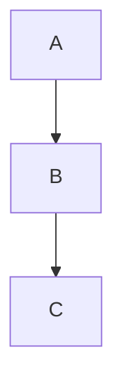

# GFM construct coverage

This fixture exercises every construct FR-080 requires, plus a right-aligned table
column, a `mermaid` fence, and inline/block math (which render as literal text).

## Headings

# H1 heading
## H2 heading
### H3 heading
#### H4 heading
##### H5 heading
###### H6 heading

## Emphasis and strikethrough

*italic*, **bold**, ***bold italic***, and ~~strikethrough~~ text.

## Lists

- Item one
- Item two
  - Nested item two-a
  - Nested item two-b
- Item three

1. First ordered item
2. Second ordered item
3. Third ordered item

## Task list

- [ ] Unchecked task
- [x] Checked task

## Block quote

> This is a block quote.
> It spans two lines.

## Horizontal rule

---

## Links and autolinks

[An inline link](https://example.com/) and an autolink: <https://example.com/auto>

## Images


## Fenced code block with syntax highlighting

```ts
function greet(name: string): string {
  return `Hello, ${name}!`;
}
```

## Table with a right-aligned column

| Left | Center | Right |
| :--- | :---: | ---: |
| a | b | c |
| dd | ee | ff |

## Mermaid fence



## Math

Inline math renders as literal text: $x$

Block math also renders as literal text:

$$y$$
