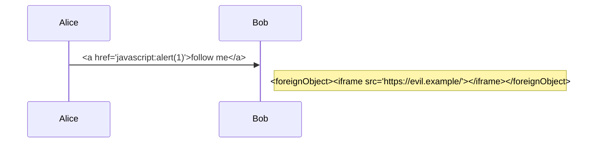

# Hostile diagrams

Every block below tries something a diagram must never do (054 FR-045). Rendered, none of it may run,
navigate or fetch.

```mermaid
%%{init: {"securityLevel": "loose", "startOnLoad": true}}%%
graph TD
  A["<script>window.__pwned = 1</script>"] --> B[""]
  click A callback "window.__pwned = 3"
  click B href "javascript:window.__pwned = 4"
  classDef bad fill:url(https://evil.example/fill.png)
  class A bad
```



Plain text after the diagrams.
