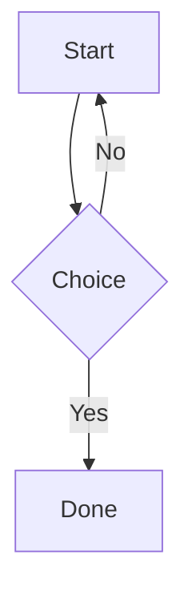

# Markdown syntax showcase

A manual test document for the throng Markdown preview. Each section names what it exercises and
what to **expect**:

- **Renders**: part of CommonMark or GFM as throng ships it (markdown-it with `html: true`,
  `linkify: true`, `typographer: false`), sanitised.
- **Not supported**: an extension throng does not render; it should appear as plain text, never
  as broken or partial output.
- **Blocked**: stripped or neutralised by the sanitiser or security policy by design.

The block above this heading is **YAML front matter**. Expected: it renders as a table (keys on the
left, nested mapping and list shown as escaped YAML), not as a horizontal rule plus text.

---

## Contents

1. [Headings](#1-headings)
2. [Paragraphs and line breaks](#2-paragraphs-and-line-breaks)
3. [Emphasis](#3-emphasis)
4. [Code](#4-code)
5. [Block quotes](#5-block-quotes)
6. [Lists](#6-lists)
7. [Thematic breaks](#7-thematic-breaks)
8. [Links](#8-links)
9. [Images](#9-images)
10. [Tables (GFM)](#10-tables-gfm)
11. [Task lists (GFM)](#11-task-lists-gfm)
12. [Strikethrough (GFM)](#12-strikethrough-gfm)
13. [Autolinks](#13-autolinks)
14. [Raw HTML](#14-raw-html)
15. [Entities and escapes](#15-entities-and-escapes)
16. [Unicode and text direction](#16-unicode-and-text-direction)
17. [Not supported: extensions](#17-not-supported-extensions)
18. [Blocked by design](#18-blocked-by-design)
19. [Stress](#19-stress)

---

## 1. Headings

**Expected: renders.** Six ATX levels, closing hashes ignored, two setext levels. Each heading gets
a slug, so it can be a link target (see section 8).

# ATX heading level 1
## ATX heading level 2
### ATX heading level 3
#### ATX heading level 4
##### ATX heading level 5
###### ATX heading level 6

### Closing hashes are ignored ###

#Not a heading (no space after the hash)

\# Not a heading (escaped hash)

Setext heading level 1
======================

Setext heading level 2
----------------------

### Duplicate heading

### Duplicate heading

The second "Duplicate heading" gets the slug `duplicate-heading-1`.

### Heading with `code`, *emphasis* and a [link](#1-headings)

---

## 2. Paragraphs and line breaks

**Expected: renders.**

A paragraph is one or more lines of text.
A single newline inside a paragraph is a soft break: it joins into the same line.

A hard break with two trailing spaces  
lands on the next line.

A hard break with a trailing backslash\
lands on the next line.

A hard break with an inline `<br>`<br>lands on the next line.

A blank line ends the paragraph.

    An indented line after a blank line is an indented code block, not a paragraph.

---

## 3. Emphasis

**Expected: renders.** `typographer` is off, so "straight quotes" and -- dashes stay as typed.

*Emphasis with asterisks* and _emphasis with underscores_.

**Strong with asterisks** and __strong with underscores__.

***Strong emphasis*** and ___strong emphasis___ and **_mixed_** and *__mixed__*.

Intra-word: un*frigging*believable renders emphasis; snake_case_word does not.

Nested: *emphasis containing **strong** inside* and **strong containing *emphasis* inside**.

Left unclosed: *not closed and **not closed either.

Literal asterisks: \*not emphasis\* and 2 * 3 * 4.

---

## 4. Code

### 4.1 Inline code

**Expected: renders.**

Use `inline code` in a sentence. Double backticks allow a literal backtick: ``code with ` inside``.
Leading and trailing single spaces are trimmed: `` `backticks` ``.

HTML stays literal inside code: `<script>alert(1)</script>`.

### 4.2 Indented code block

**Expected: renders**, with no highlighting.

    function indented() {
      return 'four spaces';
    }

### 4.3 Fenced code blocks, with highlighting

**Expected: renders.** Known languages are highlighted in the editor's colours; unknown or missing
languages are plain.

```ts
// TypeScript
interface Point { x: number; y: number }
export const origin: Point = { x: 0, y: 0 };
```

```javascript
// JavaScript
const sum = (a, b) => a + b;
console.log(sum(2, 3));
```

```python
# Python
def greet(name: str) -> str:
    return f"Hello, {name}"
```

```json
{ "name": "throng", "preview": true, "size": 10 }
```

```bash
# Shell
for f in *.md; do echo "$f"; done
```

```css
.preview { color: var(--editor-fg); }
```

```html
<section class="card"><h2>Title</h2></section>
```

```yaml
key: value
list: [a, b, c]
```

```diff
- removed line
+ added line
```

```sql
SELECT id, name FROM users WHERE active = 1;
```

```rust
fn main() { println!("hello"); }
```

```go
package main
func main() {}
```

```
No language: plain.
```

```not-a-real-language
Unknown language: plain.
```

```ts {1,3}
// Info string with attributes after the language: still highlighted as ts.
const a = 1;
const b = 2;
```

```ts:line-numbers
// Info string with a colon: the language is cut at the colon, so still ts.
const c = 3;
```

~~~python
# Tilde fence
print("tilde fence")
~~~

````markdown
A four-backtick fence can contain a three-backtick fence:
```js
nested();
```
````

---

## 5. Block quotes

**Expected: renders.**

> A single-line quote.

> A multi-line quote
> continues here.
>
> And has a second paragraph.

> Lazy continuation:
this line has no `>` but still belongs to the quote.

> Nested quotes:
>> second level
>>> third level

> A quote containing other blocks:
> ## A heading inside a quote
> - a list item
> - another
>
> ```js
> const inQuote = true;
> ```

---

## 6. Lists

### 6.1 Bullet lists

**Expected: renders.**

- dash item
- dash item

* asterisk item
* asterisk item

+ plus item
+ plus item

### 6.2 Ordered lists

**Expected: renders.**

1. first
2. second
3. third

1. all ones
1. still numbered
1. correctly

7. starts at seven
8. eight

1) parenthesis delimiter
2) second

### 6.3 Nested lists

**Expected: renders.**

- level 1
  - level 2
    - level 3
      - level 4
- back to level 1
  1. ordered inside bullet
  2. second
     - bullet inside ordered

### 6.4 Tight and loose lists

**Expected: renders.** A tight list has no paragraph spacing; a loose list does.

- tight one
- tight two

- loose one

- loose two

### 6.5 Blocks inside list items

**Expected: renders.**

1. A paragraph in an item.

   A second paragraph in the same item.

   > A quote in the item.

   ```js
   const inList = true;
   ```

2. Next item.

---

## 7. Thematic breaks

**Expected: renders.** Each line below is a horizontal rule.

***

---

___

* * *

- - -

---

## 8. Links

### 8.1 Inline and reference links

**Expected: renders.** Following a link needs **Ctrl+click**; a plain click does nothing. Tab moves
between links, and **Ctrl+Enter** follows the focused one.

[Inline link](https://example.com/)

[Inline link with title](https://example.com/ "Example title")

[Full reference link][ref-full]

[Collapsed reference link][]

[Shortcut reference link]

[Case-insensitive reference][REF-FULL]

[ref-full]: https://example.com/full "Reference title"
[Collapsed reference link]: https://example.com/collapsed
[Shortcut reference link]: https://example.com/shortcut

### 8.2 Links to headings and files

**Expected: renders.** A fragment link scrolls to the heading. A file link opens in place in the
same preview; Back returns here. A link to a missing file or heading raises one notice.

- [Same document: section 1](#1-headings)
- [Same document: second duplicate heading](#duplicate-heading-1)
- [Same document: missing heading](#this-heading-does-not-exist) *(expect one notice)*
- [Sibling file: gfm.md](gfm.md)
- [Sibling file with fragment: links/docs/setup.md#install](links/docs/setup.md#install)
- [Missing file](does-not-exist.md) *(expect one notice)*
- [Non-Markdown file](links/src/app.ts) *(opens in an editor, not the preview)*
- [Outside the project](../../../../../../outside.md) *(refused, one notice)*

### 8.3 Other schemes

**Expected:** mailto opens the mail client; the rest are inert text with no link behaviour.

- [Email link](mailto:someone@example.com)
- [JavaScript link](javascript:alert(1)) *(blocked: inert)*
- [Data link](data:text/html,<b>x</b>) *(blocked: inert)*
- [File link](file:///C:/Windows/win.ini) *(blocked: inert)*

---

## 9. Images

**Expected:**

- Project-relative images render.
- `https:` images render while *Load remote images* is on, and show their alt text when it is off.
- `http:`, `file:`, `data:` and outside-project images never load; their alt text shows instead.


![Reference image][img-ref]

[img-ref]: links/docs/image.png


[](https://example.com/)

---

## 10. Tables (GFM)

**Expected: renders**, with column alignment.

| Left | Centre | Right |
|:-----|:------:|------:|
| a    | b      | c     |
| longer left cell | centred | 123.45 |

| Default alignment | With **inline** `formatting` |
|---|---|
| [link](https://example.com/) | ~~strike~~ and *emphasis* |
| Escaped \| pipe | `code \| pipe` |

Uneven rows: missing cells are filled and extra cells are dropped.

| One | Two | Three |
|-----|-----|-------|
| only one |
| a | b | c | d |

No leading or trailing pipes:

Col A | Col B
----- | -----
1     | 2

---

## 11. Task lists (GFM)

**Expected: renders** as read-only checkboxes, drawn without bullets.

- [ ] unchecked task
- [x] checked task
- [X] checked with a capital X
- [ ] task with **formatting** and `code`
  - [x] nested checked
  - [ ] nested unchecked

Loose task list:

- [x] loose one

- [ ] loose two

Not tasks (escaped or not at the start):

- \[x] escaped marker: literal text
- text before [x] the marker: literal text
- `[x]` in inline code: literal text

---

## 12. Strikethrough (GFM)

**Expected: renders.**

~~Double tilde strikethrough~~

~Single tilde~ *(GFM accepts one tilde; markdown-it needs two, so this may stay literal)*

---

## 13. Autolinks

**Expected: renders.** Angle-bracket autolinks are CommonMark; bare URLs are linkified.

<https://example.com/angle-bracket>

<someone@example.com>

Bare URL: https://example.com/bare

Bare www: www.example.com

Bare email: someone@example.com

A URL in parentheses (https://example.com/in-parens) keeps the closing parenthesis out.

Not linkified inside code: `https://example.com/code`.

---

## 14. Raw HTML

**Expected: renders**, but only the sanitiser's allowed tags and attributes survive.

<details>
<summary>Details and summary (click to expand)</summary>

Hidden content with **Markdown** inside.

</details>

Keyboard: <kbd>Ctrl</kbd> + <kbd>Enter</kbd>

Subscript H<sub>2</sub>O and superscript E = mc<sup>2</sup>.

Inserted <ins>text</ins> and deleted <del>text</del>.

<mark>Mark element</mark>: the text stays, the yellow highlight is removed.

Inline <span>span</span> and a block div:

<div>A div with <em>inline emphasis</em>.</div>

<dl>
  <dt>Definition term</dt>
  <dd>Definition description</dd>
</dl>

An HTML comment follows and should not appear: <!-- invisible comment -->

<p align="center">An align attribute: stripped, left aligned.</p>

<p style="color: red">An inline style: stripped, not red.</p>

---

## 15. Entities and escapes

**Expected: renders.**

Named: &copy; &reg; &trade; &nbsp;(nbsp) &amp; &lt; &gt; &quot;

Decimal: &#169; &#8364; — Hex: &#xA9; &#x20AC;

Invalid entity stays literal: &notanentity;

Backslash escapes: \\ \` \* \_ \{ \} \[ \] \( \) \# \+ \- \. \! \|

A non-escapable backslash stays: \q

---

## 16. Unicode and text direction

**Expected: renders.**

Emoji: 😀 🎉 👍🏽 👨‍👩‍👧 🇬🇧

Accents: café naïve Zürich São Paulo

CJK: 日本語のテキスト 中文文本 한국어 텍스트

Right to left: שלום עולם — مرحبا بالعالم

Mixed direction in one line: English עברית English العربية English.

Combining marks: e&#x301; a&#x308; n&#x303;

Zero-width joiner and non-joiner: a‍b a‌b

---

## 17. Not supported: extensions

**Expected: not supported.** Each item below should appear as readable plain text or a plain code
block, never half-rendered.

### 17.1 Footnotes

Here is a footnote reference[^1] and another[^note].

[^1]: The footnote text.
[^note]: A named footnote.

### 17.2 GitHub alerts

> [!NOTE]
> An informational alert.

> [!WARNING]
> A warning alert.

### 17.3 Math (#393)

Inline math: $E = mc^2$

Block math:

$$
\int_0^1 x^2 \, dx = \frac{1}{3}
$$

### 17.4 Mermaid (#392)

Expected: a plain code block, not a diagram.



### 17.5 Emoji shortcodes

:smile: :tada: :+1:

### 17.6 Custom heading ids

### Heading with a custom id {#custom-id}

### 17.7 Definition lists (Markdown syntax)

Term
: Definition

### 17.8 Highlight, superscript, subscript (Markdown syntax)

==highlighted== x^2^ H~2~O

### 17.9 Abbreviations

*[HTML]: HyperText Markup Language

HTML should not show a tooltip.

### 17.10 Table of contents markers

[[_TOC_]]

[TOC]

### 17.11 Wiki links

[[Some Wiki Page]]

### 17.12 Attribute lists

A paragraph with attributes.
{: .class #id }

### 17.13 GitHub references

Issue #10, commit 2d222e49, user @someone: plain text, no links (throng is not GitHub).

---

## 18. Blocked by design

**Expected: blocked.** Nothing here runs, loads or navigates. The visible result is text or nothing.
The full hostile set is in `hostile.md`; this is a short sample.

<script>alert('script')</script>


<iframe src="https://example.com/"></iframe>

<a href="javascript:alert('link')">JavaScript anchor</a>

<form action="https://example.com/"><input type="text" value="form input"></form>

<p aria-hidden="true">aria-hidden paragraph: the text is visible because the attribute is stripped.</p>

<video src="https://example.com/v.mp4"></video>

<style>body { background: red; }</style>

<meta http-equiv="refresh" content="0; url=https://example.com/">

<base href="https://example.com/">

<h2 data-heading-slug="spoof">Spoofed heading slug</h2>

[Link to the spoofed slug](#spoof) *(expect the missing-heading notice)*

---

## 19. Stress

**Expected: renders** without freezing, and the reading position holds while you type in the editor.

### 19.1 A very long line

Lorem ipsum dolor sit amet, consectetur adipiscing elit, sed do eiusmod tempor incididunt ut labore et dolore magna aliqua. Ut enim ad minim veniam, quis nostrud exercitation ullamco laboris nisi ut aliquip ex ea commodo consequat. Duis aute irure dolor in reprehenderit in voluptate velit esse cillum dolore eu fugiat nulla pariatur. Excepteur sint occaecat cupidatat non proident, sunt in culpa qui officia deserunt mollit anim id est laborum. Averylongwordwithoutanybreakingopportunitiesthatshouldwraporscrollwithoutbreakingthelayoutofthepreviewpanelatall.

### 19.2 Deep nesting

> > > > > > Six levels of quote.

- a
  - b
    - c
      - d
        - e
          - f
            - g
              - h

### 19.3 A wide table

| c1 | c2 | c3 | c4 | c5 | c6 | c7 | c8 | c9 | c10 | c11 | c12 | c13 | c14 | c15 | c16 |
|----|----|----|----|----|----|----|----|----|-----|-----|-----|-----|-----|-----|-----|
| 1  | 2  | 3  | 4  | 5  | 6  | 7  | 8  | 9  | 10  | 11  | 12  | 13  | 14  | 15  | 16  |

### 19.4 End marker

If you can read this line, the whole document rendered.
